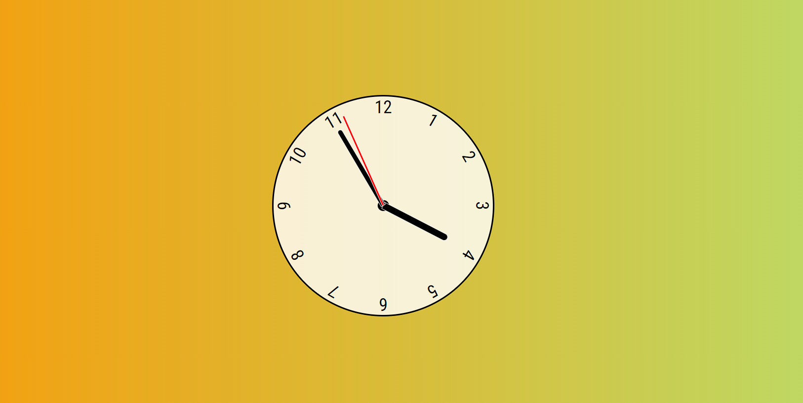

# Analog Clock Project



## Introduction

This project is a simple analog clock created using HTML, CSS, and JavaScript. It displays the current time with hour, minute, and second hands.

## Requirements

- Web browser

## How to Use

1. Clone or download the repository.

```bash
git clone https://github.com/Vishal2002/Analog-Clock.git
```

2. Open `index.html` in a web browser to view the analog clock.

3. The clock updates in real-time to show the current time.

## Customization

You can customize the clock's appearance by modifying the CSS and JavaScript files.


## Author

- [Vishal Sharma](https://github.com/Vishal2002)

Feel free to contribute, make improvements, and share this project!


```
